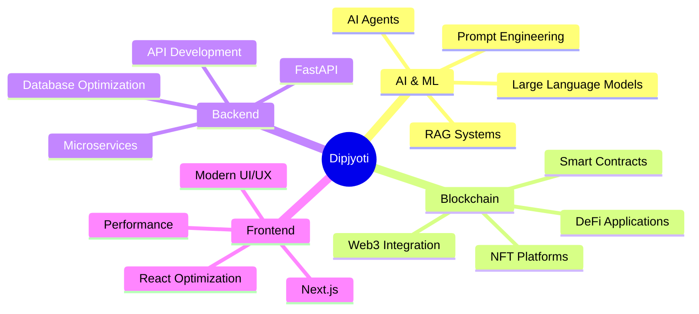

# 👋 Hi, I'm Dipjyoti Kashyap

<div align="center">
  
  

  
  
  

</div>

---

## 🚀 About Me

```typescript
const dipjyoti = {
    location: "Jorhat, Assam, India 🇮🇳",
    currentFocus: ["AI Agents", "LLMs", "Blockchain", "FastAPI"],
    interests: ["Programming", "Web3", "Machine Learning", "DeFi"],
    collaboration: "Open to exciting opportunities!",
    funFact: "Building decentralized AI-powered applications 🌐🤖"
};
```

<div align="center">

### 💼 Let's Connect!

[](https://www.linkedin.com/in/dip-jyoti-kashyap-3111181b1/)
[](https://github.com/dipjerry)
[](mailto:your.email@example.com)
[](https://dipjerry.github.io)

</div>

---

## 💻 Tech Stack

### 🎨 Frontend Development
<div align="center">


</div>

### ⚙️ Backend Development
<div align="center">


</div>

### 🤖 AI & Machine Learning 
<div align="center">


</div>

### ⛓️ Blockchain & Web3
<div align="center">


</div>

### ☁️ DevOps & Cloud
<div align="center">


</div>

### 🛠️ Tools & Platforms
<div align="center">


</div>

---

## 📊 GitHub Statistics

<div align="center">
  
  
  
  
  
  

</div>

---

## 🏆 GitHub Trophies

<div align="center">
  
  

</div>

---

## 📈 Contribution Graph

<div align="center">
  
  

</div>

---

## 🎯 Current Focus



---

## 🌟 Featured Projects

<div align="center">

| 🚀 Project | 💡 Description | 🛠️ Tech Stack |
|-----------|---------------|----------------|
| **AI Chat Assistant** | LLM-powered conversational AI with RAG | FastAPI, LangChain, OpenAI |
| **DeFi Protocol** | Decentralized finance smart contracts | Solidity, Ethereum, Web3.js |
| **Agent Orchestration** | Multi-agent system for automation | Python, AI Agents, FastAPI |
| **NFT Marketplace** | Full-stack Web3 marketplace | React, Next.js, Solidity |

</div>

---

## 💡 What I'm Learning

<div align="center">

```ascii
╔═══════════════════════════════════════╗
║  🔥 AI Agents & LLM Engineering       ║
║  🔥 Advanced FastAPI Patterns         ║
║  🔥 Zero-Knowledge Proofs             ║
║  🔥 Distributed Systems               ║
║  🔥 Web3 Security Best Practices      ║
╚═══════════════════════════════════════╝
```

</div>

---

## 🤝 Let's Collaborate!

<div align="center">

I'm always interested in collaborating on:
- 🤖 AI/ML Projects & LLM Applications
- ⛓️ Blockchain & Web3 Innovations
- 🚀 Open Source Contributions
- 💡 Innovative Startups & Ideas

**Feel free to reach out for collaborations or just a friendly chat!**

</div>

---

## 📫 How to Reach Me

<div align="center">

[](https://www.linkedin.com/in/dip-jyoti-kashyap-3111181b1/)
[](https://github.com/dipjerry)
[](mailto:your.email@example.com)

</div>

---

<div align="center">

### ⚡ Fun Fact
  
*"I believe the future is decentralized, AI-powered, and open-source!"*


**Thanks for visiting! Don't forget to ⭐ star some repositories if you find them interesting!**

</div>

---

<div align="center">
  
  ### 🎨 Profile Aesthetics Powered By
  
  
  
  
</div>
